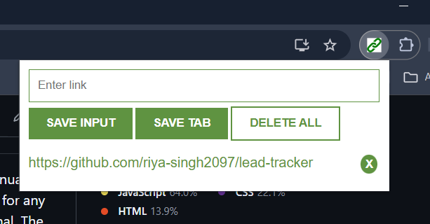
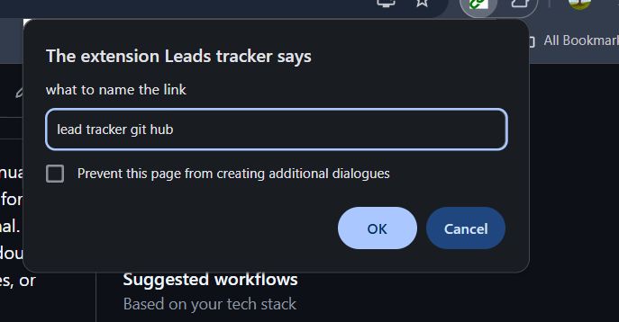
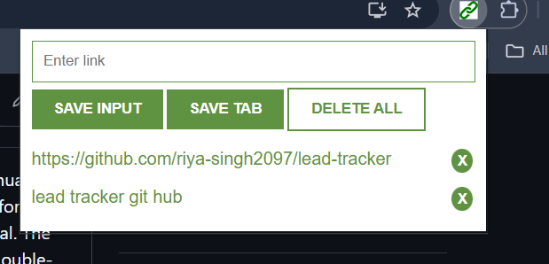

<h1>Lead-tracker</h1>

Lead Tracker is a simple browser extension for saving and organizing web links (leads). Users can add URLs manually by typing, save the current browser tab instantly using the "Save Tab" button, or use the regular "Save" button for any entered link. Optionally, a custom name can be given to each link through a prompt—this is completely optional. The app supports easy link management: double-tap the "❌" button next to any item to delete it individually, or double-tap the "Delete All" button to clear the entire list in one go. Perfect for keeping track of useful resources, articles, or any links you don’t want to lose.

Built using **HTML, CSS, and JavaScript**.

---

## ✨ Features

- 🔗 Save current tab URL  
- ✏️ Add custom named links  
- 💾 Persistent storage using localStorage  
- 🧹 Delete all saved leads  
- ⚡ Clean and user-friendly UI  

---

<h1>How to set up?</h1>
<ul>
  <li>Install the repo by clicking on code & downloading the zip file</li>
  <li>Unzip the folder & save it in a place where it is accessible</li>
  <li>Open up your browser</li>
  <li>Go to the extensions page. Example: brave://extensions/ or chrome://extensions/</li>
  <li>Enable Developer Mode, should be at the top right</li>
  <li>Click on "Load Unpacked"</li>
  <li>Select the folder you just unzipped by navigating to the respective location</li>
  <li>Go back to the extensions tab, and toggle the extension to turn it on</li>
  <li>Make sure to go to details & allow it to run in private tabs too</li>
  <li>And all done</li>
</ul>

## 📸 Screenshots

### 🔹 Main Interface

### 🔹 Add Lead Input

### 🔹 Save Current Tab Feature

